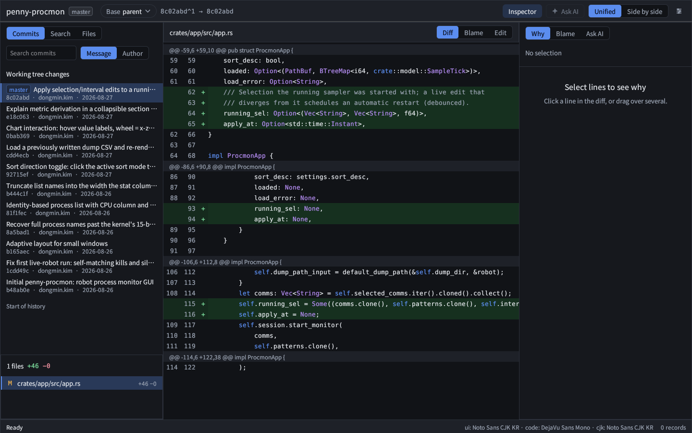
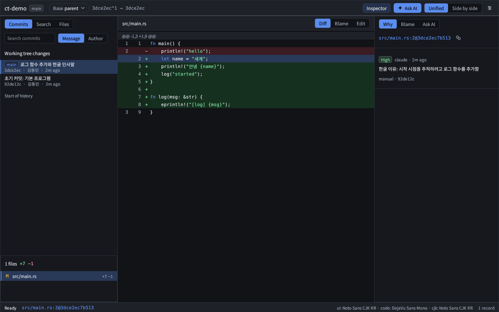
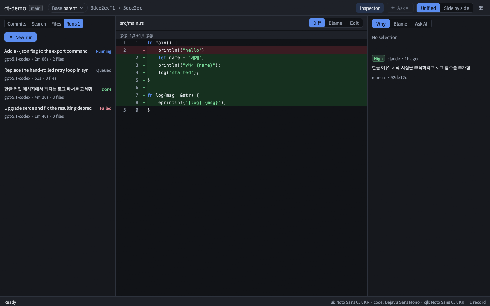
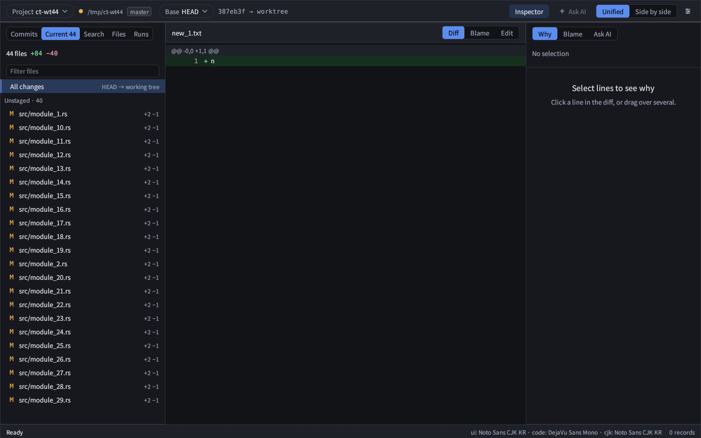
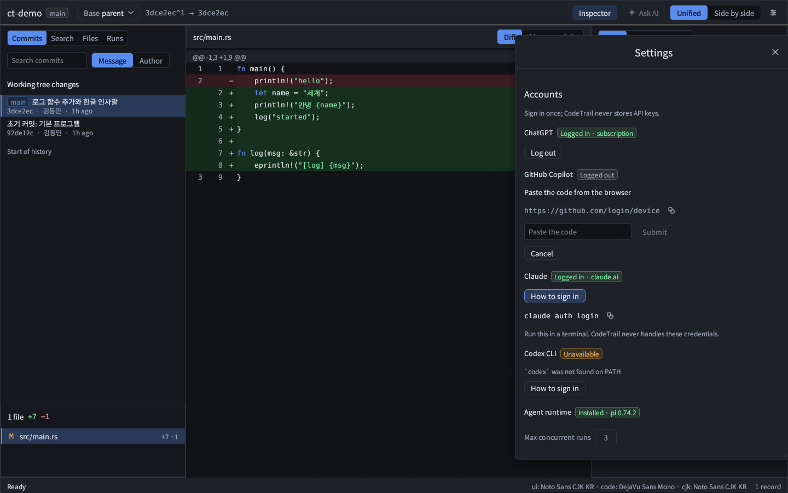
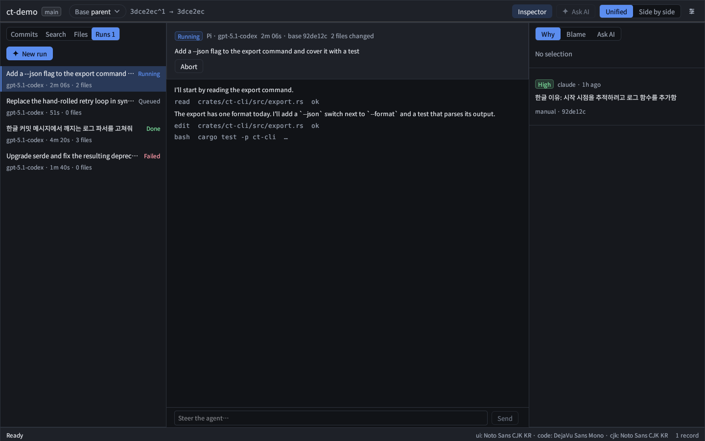
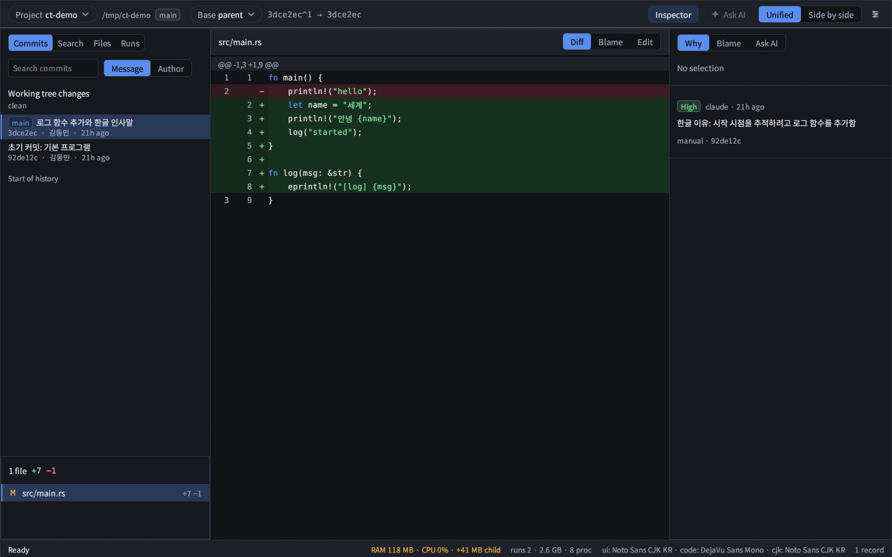

# codetrail

A lightweight desktop viewer (Rust + egui, Linux) for reviewing git changes, with a record of **why** AI agents changed each line.

[한국어](README.ko.md) · [Changelog](CHANGELOG.md) · [Design notes](PLAN.md) (Korean)



> Screenshots in `docs/screens/` are rendered from a small demo repository with demo agent data (`--smoke`), not from a live account.

## What it is

- **Review commits and current changes.** Commit list, per-commit file list, unified or side-by-side diff, rename/binary handling. The **Current** tab shows staged / unstaged / untracked changes.
- **Pick the base.** `Base` in the top bar (`Ctrl+B`): parent (default), previous selection, current changes (working tree), any ref, or merge-base of a ref.
- **AI change history + why.** Hooks/skills record every agent edit; the **Why** panel shows the reason and a confidence level for the selected lines. **Blame** follows a line's history.
- **Ask AI.** Select lines, `Ctrl+L`: the code, diff, recorded reasons and your question go to Pi (ChatGPT / GitHub Copilot), Claude Code or Codex.
- **Runs in background worktrees.** Give an agent a task; it works in its own git worktree and branch. Review the result, then Apply (merge) or Discard.
- **Fast search.** `Ctrl+P` file names (fuzzy), `Ctrl+Shift+F` text (literal/regex/case), commit message/author filter.
- **Light.** Idle CPU and memory are budgeted and shown in the status bar (see [Resource budget](#resource-budget)).

| Why | Runs |
|---|---|
|  |  |

## Install

> The packaging described here is produced by the release scripts under `dist/`. File names and flags are as specified; **this README was written before they were verified** (see [Verification status](#verification-status)).

Tarball:

```
tar xzf codetrail-<ver>-linux-x86_64.tar.gz
cd codetrail-<ver>-linux-x86_64
./install.sh --prefix ~/.local        # puts `codetrail` in <prefix>/bin
```

Debian/Ubuntu:

```
sudo apt install ./codetrail_<ver>_amd64.deb
```

From source: `cargo build --release -p ct-app` → `target/release/codetrail` (a single binary; CLI and GUI).

Runtime requirements:

- `git` (every git operation shells out to it)
- X11 or Wayland with OpenGL (the GL library is loaded at runtime; the binary links only libc/libm/libgcc)
- Recommended: `fonts-noto-cjk` (the app looks for Pretendard, D2Coding, Noto Sans CJK; without a Hangul-capable font Korean text is not shown)
- For the Pi backend only: `npm` + network on first use (see [Accounts & models](#accounts--models))

## Quick start

```
codetrail                 # opens the last project, or the project picker
codetrail /path/to/repo   # open a repo
```

`Ctrl+O` switches project (recent list + folder browser).

Left rail tabs: **Commits** · **Current** · **Search** · **Files** · **Runs**.

1. **Commits**: click a commit (or `j`/`k`). The diff shows against the base in the top bar. `[` / `]` jump between hunks.
2. **Base**: `Ctrl+B` → Parent / Previous selection / Current changes / any ref / Merge-base.
3. **Current**: uncommitted changes, grouped Staged / Unstaged / Untracked.
4. Centre view: **Diff · Blame · Edit**. Inspector (right): **Why · Blame · Ask AI** (`Inspector` button hides it).
5. **Why**: select lines in the diff; recorded reasons appear with a confidence badge (High = exact blob match, Medium = added-line fingerprint, otherwise Unknown; there is no time-based guessing).
6. **Ask AI**: select lines, `Ctrl+L`, pick a model, send. `Ctrl+Shift+C` copies the reference `path:L1-L2@<commit|worktree>` instead.
7. **Edit**: `Ctrl+E` toggles the editor, `Ctrl+S` saves. Files over 1 MB and binary files are read-only; external changes are detected.



## Agent integration

```
codetrail install [--claude] [--omp] [--codex] [--dry-run]
```

With no agent flag, all three are installed. The command is idempotent, merges instead of overwriting, and backs up an existing file before changing it. `--dry-run` prints what would change. Example (empty `$HOME`):

```
$ codetrail install --dry-run
would create ~/.claude/settings.json
would create ~/.claude/skills/codetrail/SKILL.md
would create ~/.agents/skills/codetrail/SKILL.md
would create ~/.codex/AGENTS.md
```

| Flag | Files touched |
|---|---|
| `--claude` | `~/.claude/settings.json` (PreToolUse, PostToolUse, PostToolUseFailure, Stop hooks running `codetrail hook claude <event>`, matcher `Edit\|Write\|MultiEdit\|NotebookEdit`, timeout 5 s), `~/.claude/skills/codetrail/SKILL.md` |
| `--omp` | `~/.agents/skills/codetrail/SKILL.md` |
| `--codex` | `~/.codex/AGENTS.md` (a block between `<!-- codetrail BEGIN -->` and `<!-- codetrail END -->`) |

- **Claude Code** records edits automatically through hooks (hooks always exit 0 and never block the agent) and tells the agent the exact `note` command to run.
- **omp / Codex** get instructions only (skill / AGENTS.md); they have no automatic hook. The agent runs `codetrail record --path <file> --agent <omp|codex>` and then `codetrail note`.

Other commands:

```
codetrail note --record <id> --reason "<why>"       # attach a reason (or --session S --path P)
codetrail record --path <file> [--agent A --session S]   # record a worktree edit vs HEAD (no-hook agents)
codetrail record <id> [--json]                       # show one record
codetrail export [--json]                            # all records (TSV, or JSON)
codetrail ask <path:L1-L2@rev> [--question Q] [--agent claude|omp|codex] [--print]
```

`ask` flags: `--no-code --no-diff --no-reasons --no-transcript`, `--include-secrets`, `--timeout <secs>` (default 300). `--print` prints the prompt instead of calling an agent.

**Storage.** Records live in `<git_dir>/codetrail/log.ct` (+ `index.ct`): binary frames, reasons zstd-compressed. They are **local only** and are not part of git history: deleting `.git` or re-cloning loses them, so use `codetrail export --json` to back them up. Nothing is uploaded by codetrail itself; `ask` and Runs send data only to the agent you chose.

**Privacy.** `ask` warns about and excludes prompt sections that look like secrets unless you pass `--include-secrets`. Run reasons and event logs are secret-masked before they are stored.

## Accounts & models

Open **Settings → Accounts** (or the model picker). codetrail never stores API keys.

| Backend | How you sign in |
|---|---|
| **Pi** (ChatGPT / OpenAI Codex, GitHub Copilot) | OAuth through the Pi runtime that codetrail installs privately under `~/.local/share/codetrail/agent` (node + pi via `npm ci`, needs network once). Tokens are kept by Pi in its own `auth.json` under that directory. |
| **Claude** | Only through the official `claude` CLI: run `claude auth login` yourself. codetrail only calls `claude auth status` and runs `claude` for prompts. Anthropic OAuth through third-party tools is deliberately not offered; see [Anthropic's terms](https://code.claude.com/docs/en/legal-and-compliance). |
| **Codex** | Official `codex` CLI: `codex login`. |

An account can be switched off with `accounts_disabled` in `config.toml`.



## Runs

**Runs → New run**: choose backend/model, write the task, optionally keep **Isolate in a separate worktree** (default, recommended).

- The agent works in `~/.local/share/codetrail/worktrees/<repo-id>/<run-id>` on branch `ct/<slug>-<id>`, based on the commit you chose (resolved to a SHA at submit). Your checkout, index and branches are not touched.
- **This is not a security sandbox.** The agent runs with your user permissions and can run commands, read your files and use the network. The worktree only keeps *your working copy* separate.
- When the run ends its changes are committed to the run branch. **Apply** = `git merge --no-ff` of that exact commit into your current branch (refused on a dirty tree or if the branch moved after review; a conflicting merge is aborted and nothing changes). **Discard** removes the worktree and branch.
- Stopping a run: Abort → grace period → SIGTERM to the whole process group → SIGKILL.
- Limits: `agent.max_concurrent` (default 3, range 1–8); per run 3072 MB RSS (3 consecutive samples) and 120 min; global 6144 MB across running runs, beyond which new runs stay Queued. A run over a limit ends as Failed with `resource limit: …`. **These per-run/global values are built-in defaults and are not configurable in `config.toml` yet.**
- Data: `~/.local/share/codetrail` (or `$CT_DATA_DIR`, else `$XDG_DATA_HOME/codetrail`): `runs/<id>/` (run.json, events log), `worktrees/`, `agent/`.
- After a restart, runs that were still running are marked Interrupted (their processes are killed; uncommitted work in an isolated worktree is kept as an artifact commit). Live output of those runs is not restored.



## Resource budget

| Item | Budget / limit | Measured (team test reports) |
|---|---|---|
| GUI idle CPU | < 1 % averaged; the resource sampler runs only while the window is focused | ≈ 0.6 % |
| GUI idle RSS | ≤ 150 MB | 86–104 MB |
| concurrent git processes | 4, process-wide; each has a timeout (default 30 s, `git_timeout_secs`) and is killed as a group | 4 observed max |
| git output buffer | 64 MiB, then an error instead of unbounded memory | — |

The status bar shows `RAM <app> · CPU <n>%`, plus children and a runs subtotal when runs are active; it turns amber above 70 % and red above 100 % of its budget (app 150 MB, runs 6144 MB).



The numbers in the last column come from other team members' test reports and were not re-measured while writing this document.

## Configuration

`~/.config/codetrail/config.toml` (`$XDG_CONFIG_HOME/codetrail/`), written by the Settings panel; colours are in `theme.toml` in the same directory. An invalid file falls back to defaults with a banner. Values are clamped.

| Key | Default | Range |
|---|---|---|
| `ui_font_size` | 13 | 9–24 |
| `code_font_size` | 13 | 9–28 |
| `tab_width` | 4 | 1–16 |
| `split_view` | false | side-by-side diff |
| `ask_preview` | true | show prompt before sending |
| `ask_timeout_secs` | 180 | 5–3600 |
| `git_timeout_secs` | 30 | 1–600 |
| `rail_width` | 340 | 240–640 |
| `inspector_width` | 360 | 260–640 |
| `files_split` | unset | share of rail height for the file list |
| `accounts_disabled` | `[]` | account ids: `claude`, `codex`, `openai-codex`, `github-copilot` |
| `[agent]` `backend` | `pi` | `pi` \| `claude` \| `codex` |
| `[agent]` `provider`, `model`, `thinking` | unset | last model selection |
| `[agent]` `max_concurrent` | 3 | 1–8 |
| `recent` | `[]` | recent projects (max 12), managed by the app |

## Keyboard shortcuts

| Key | Action |
|---|---|
| `Ctrl+P` | Go to file |
| `Ctrl+Shift+F` | Search in files |
| `Ctrl+K` | Command palette |
| `Ctrl+O` | Switch project |
| `Ctrl+B` | Change base |
| `Ctrl+E` / `Ctrl+S` | Toggle editor / save |
| `Ctrl+G` | Go to line |
| `Ctrl+L` | Ask AI about the selection |
| `Ctrl+Shift+C` | Copy code reference |
| `j` / `k` | Next / previous commit |
| `[` / `]` | Previous / next hunk |
| `Esc` | Close popups |

Single-key shortcuts are ignored while a text field has focus.

## Troubleshooting

- **No models in the picker.** Not signed in, or the CLI is missing: Claude needs `claude` on `PATH` and `claude auth login`; Codex needs `codex login`; Pi needs the runtime installed (first use runs `npm ci`: requires `npm` on `PATH` and network, ceiling 15 min; node 22 and Pi are installed *inside* `~/.local/share/codetrail/agent`, nothing global).
- **Pi login does nothing.** The login opens a browser URL; the helper has a 10-minute ceiling.
- **Hook timeouts.** Claude hooks have a 5 s timeout and always exit 0, so a slow or broken `codetrail` never blocks the agent; an edit may then simply be unrecorded. Check `codetrail export`.
- **Korean text shows boxes.** Install `fonts-noto-cjk` (or Pretendard / D2Coding) and restart.
- **Hooks installed but nothing recorded.** `codetrail` must be on the `PATH` seen by the agent (the hook command is the bare name `codetrail`; set `CODETRAIL_BIN` when running `install` to write another command).
- **Records are missing after a re-clone.** They are not in git; see Storage.

## Known limits

- Korean IME input is unverified (display is verified).
- Non-UTF-8 paths are shown lossily.
- Combined (`-c` / `--cc`) merge diffs are unsupported (a commit is diffed against its first parent).
- Live run output is lost on restart (the result/artifact is kept).
- Pi 0.74.2 sends no "settled" event; codetrail decides a Pi run is finished after a 400 ms quiet period, so a retry starting later than that is reported as a second run.
- Linux only (code avoids Linux-specific APIs where practical, but only Linux is tested; resource sampling reads `/proc`).
- Editor: files over 1 MB or binary are read-only.

## Uninstall

Tarball: `./uninstall.sh --prefix ~/.local` (same prefix). Deb: `sudo apt remove codetrail`. Neither removes your data; delete by hand if wanted:

```
rm -rf ~/.config/codetrail ~/.local/share/codetrail   # settings, runs, worktrees, Pi runtime
```

Agent hooks/skills stay in `~/.claude`, `~/.agents`, `~/.codex` (backups are created next to the files `install` changed): remove the `codetrail hook claude …` entries from `~/.claude/settings.json`, the `codetrail` skill directories, and the codetrail block in `~/.codex/AGENTS.md`. Records stay in each repo's `.git/codetrail/`.

## Development

```
cargo test --workspace
cargo build --release -p ct-app
codetrail --smoke <repo> --screenshot out.png --scene <name> [--size WxH] [--query TEXT]
```

Scenes: `commit split search why light settings runs runs-stream accounts model-picker new-run project-picker folder-browser worktree current-dirty current-clean resources`.

Live tests are skipped unless enabled: `CT_LIVE=1` (real Codex / Claude runs in `ct-runs`, `ct-agentd`), `CT_LIVE_PI=1`, `CT_LIVE_SETUP=1` (real `npm ci` into `CT_DATA_DIR`), `CT_LIVE_SECS` (live run timeout).

Crates:

- `ct-core`: read-only git access through the `git` CLI (log, diff parsing, blame, file/text search), bounded subprocesses (4-slot limiter, timeouts, group kill, output caps).
- `ct-store`: the append-only binary record log (`log.ct`/`index.ct`): records, reasons, confidence and commit linking, JSON export.
- `ct-agent`: the CLI subcommands (`install`, `hook`, `note`, `record`, `ask`, `export`), hook handling, and one-shot `ask` through claude/omp/codex.
- `ct-agentd`: agent backends for the GUI (Pi RPC, Claude, Codex), accounts/login, model lists, the private Pi runtime.
- `ct-runs`: background runs: queue, worktree isolation, process supervision, artifact commits, Apply/Discard, resource sampler and limits.
- `ct-app`: the egui application and the `codetrail` binary (GUI + subcommand dispatch).

## Verification status

What was run while writing this document, against `target-m/release/codetrail` in a throw-away repo and `$HOME`: `install --dry-run`, `install --claude`, `install` (all), repeated install (all `unchanged`), `record --path`, `export`, `export --json`, `note`, `record <id>`, `ask --print`, `--smoke … --scene commit`, `--bogus` (usage, exit 2). Everything else is taken from the source code or from other team members' reports. The packaging section (`install.sh`, `uninstall.sh`, the `.tar.gz`/`.deb` names) was written to the specification and **not** run.

License: MIT.
